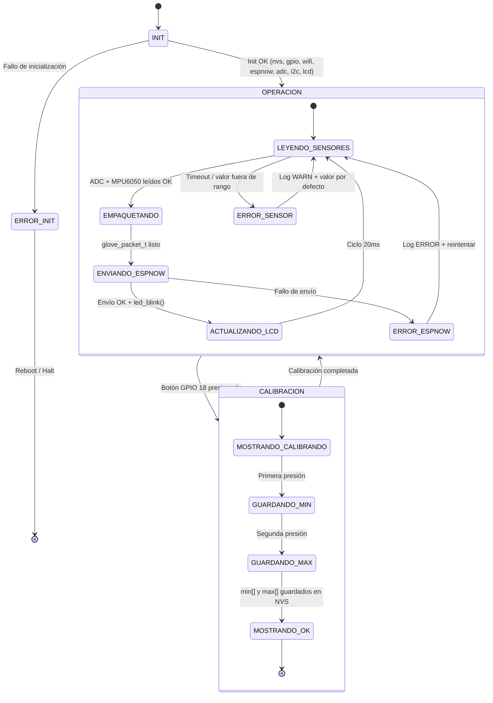
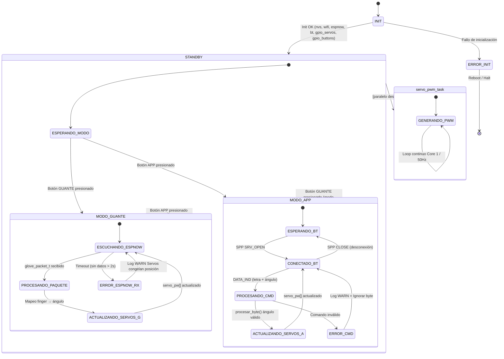

## Arquitectura de Firmware
### Diagrama del Sistema Completo

El sistema se compone de tres nodos principales que interactúan mediante distintos protocolos de comunicación:

```
┌─────────────────────────────────────────────────────────────────────────────┐
│                         SISTEMA MANO ROBÓTICA                               │
│                                                                             │
│  ┌──────────────────────┐   ESP-NOW (WiFi 2.4GHz)   ┌──────────────────────┐│
│  │   ESP32 #1 — GUANTE  │ ───────────────────────>  │  ESP32 #2 — MANO     ││
│  │  (Transmisor)        │      glove_packet_t       │  ROBÓTICA (Receptor) ││
│  │                      │         12 bytes          │                      ││
│  │  ┌────────────────┐  │      latencia < 5ms       │  ┌────────────────┐  ││
│  │  │5 Potenciómetros│  │                           │  │  6 Servos PWM  │  ││
│  │  │  (dedos ADC)   │  │                           │  │ (5 dedos +     │  ││
│  │  └────────────────┘  │                           │  │  muñeca)       │  ││
│  │  ┌────────────────┐  │                           │  └────────────────┘  ││
│  │  │  MPU6050 I2C   │  │                           │  ┌────────────────┐  ││
│  │  │  (muñeca)      │  │                           │  │ 2 Botones Modo │  ││
│  │  └────────────────┘  │                           │  │ GUANTE / APP   │  ││
│  │  ┌────────────────┐  │                           │  └────────────────┘  ││
│  │  │   LCD I2C      │  │                           └──────────┬───────────┘│
│  │  │  (calibración) │  │                                      │            │
│  │  └────────────────┘  │                          BT Classic SPP           │
│  │  ┌────────────────┐  │                                      │            │
│  │  │ Botón Calib.   │  │                           ┌──────────▼───────────┐│
│  │  │ LED + Motor    │  │                           │   APP MÓVIL          ││
│  │  │ Vibración      │  │                           │  (Bluetooth SPP)     ││
│  │  └────────────────┘  │                           │                      ││
│  └──────────────────────┘                           │  Control manual:     ││
│          │  │                                       │  letra + ángulo      ││
│       UART UART                                     │  Visualización estado││
│       (log)(log)                                    └──────────────────────┘│
└─────────────────────────────────────────────────────────────────────────────┘
```
### Arquitectura por Capas — ESP32 #1 (Guante)

La arquitectura implementa el patrón **Layer Architecture** con tres capas bien definidas que garantizan separación de responsabilidades y desacople entre módulos.

```
┌──────────────────────────────────────────────────────────────┐
│                   CAPA 3 — APP LAYER                         │
│                      app_main()                              │
│   Orquestador: decide cuándo usar los servicios              │
│   Loop 20ms: lee sensores → empaqueta → envía ESP-NOW        │
│   Gestiona calibración por botón GPIO 18                     │
├──────────────────────────────────────────────────────────────┤
│                CAPA 2 — DRIVERS / SERVICIOS                  │
│   process_finger()   normalize_value()   mpu6050_read()      │
│   lcd_show_status()  led_blink()         on_data_sent()      │
│   Filtro EMA         Zona muerta ±2      Normalización 0-100%│
├──────────────────────────────────────────────────────────────┤
│                 CAPA 1 — HAL (Hardware Abstraction)          │
│   gpio_init_custom()   adc_init_custom()   i2c_init()        │
│   lcd_init()           wifi_init()         espnow_init()     │
│   Inicialización de registros y periféricos del ESP32        │
└──────────────────────────────────────────────────────────────┘
         │            │            │            │
      GPIO 2      ADC1 (5ch)    I2C bus      WiFi STA
      GPIO 18     12 bits       400kHz       ESP-NOW TX
      GPIO 19     11dB att.    MPU6050+LCD
      GPIO 5      GPIO 32-35
```
#### Tabla de Funciones — Guante

| Capa | Función | Descripción | Periférico |
|------|---------|-------------|------------|
| **HAL** | `gpio_init_custom()` | Configura LED (GPIO 2), motor vibración (GPIO 19), botones (GPIO 18, 5) | GPIO |
| **HAL** | `adc_init_custom()` | Inicializa ADC1, resolución 12 bits, atenuación 11 dB, 5 canales | ADC1 |
| **HAL** | `i2c_init()` | Configura bus I2C maestro compartido (MPU6050 + LCD) a 400 kHz | I2C |
| **HAL** | `lcd_init()` | Inicializa pantalla LCD I2C (dirección 0x27) | I2C / LCD |
| **HAL** | `wifi_init()` | Inicializa WiFi en modo STA (requerido para ESP-NOW) | WiFi |
| **HAL** | `espnow_init()` | Configura ESP-NOW modo TX, registra peer de la mano robótica | ESP-NOW |
| **Driver** | `process_finger(index, channel)` | Lee ADC → aplica filtro EMA (÷8) → normaliza 0–100% → aplica zona muerta ±2 | ADC1 |
| **Driver** | `normalize_value(raw, min, max)` | Mapea valor crudo a porcentaje según calibración guardada | Software |
| **Driver** | `mpu6050_read_pitch_roll()` | Lee registros I2C del giroscopio → calcula pitch y roll | I2C / MPU6050 |
| **Driver** | `lcd_show_status()` | Muestra estado de calibración en pantalla LCD | I2C / LCD |
| **Driver** | `led_blink()` | Parpadeo del LED indicador 20 ms al enviar paquete exitosamente | GPIO |
| **Driver** | `on_data_sent()` | Callback ESP-NOW: confirma envío exitoso, actualiza contadores | ESP-NOW |
| **APP** | `app_main()` | Inicializa todos los módulos; loop principal 20 ms | Orquestador |

---

### Arquitectura por Capas — ESP32 #2 (Mano Robótica)

```
┌──────────────────────────────────────────────────────────────┐
│                   CAPA 3 — APP LAYER                         │
│                      app_main()                              │
│   Orquestador: determina modo_actual (GUANTE / APP)          │
│   Loop 20ms: lee botones → activa modo → reporte 500 ciclos  │
│   Lanza servo_pwm_task en Core 1                             │
├──────────────────────────────────────────────────────────────┤
│                CAPA 2 — DRIVERS / SERVICIOS                  │
│   on_data_received()   spp_callback()    procesar_byte()     │
│   servo_pwm_task()     angle_to_us()     map_val()           │
│   constrain_i/f()      log_system_status() get_timestamp_ms()│
├──────────────────────────────────────────────────────────────┤
│                 CAPA 1 — HAL (Hardware Abstraction)          │
│   nvs_flash_init()     wifi_init()       espnow_init()       │
│   bt_init()            gpio_init_servos() gpio_init_buttons()│
│   Inicialización de registros y periféricos del ESP32        │
└──────────────────────────────────────────────────────────────┘
         │            │            │            │
      6 GPIOs      WiFi STA    BT Classic    2 GPIOs
      Servos PWM   ESP-NOW RX  SPP "ROBOT    botones
      Core 1       callback    _HAND"        modo
```

#### Tabla de Funciones — Mano Robótica

| Capa | Función | Descripción | Periférico |
|------|---------|-------------|------------|
| **HAL** | `nvs_flash_init()` | Inicializa Non-Volatile Storage del ESP32 | NVS |
| **HAL** | `wifi_init()` | Inicializa WiFi STA (requerido para ESP-NOW en coexistencia con BT) | WiFi |
| **HAL** | `espnow_init()` | Configura ESP-NOW como receptor, registra callback `on_data_received()` | ESP-NOW |
| **HAL** | `bt_init()` | Inicializa BT Classic + pila Bluedroid + servidor SPP (nombre: "ROBOT_HAND") | Bluetooth |
| **HAL** | `gpio_init_servos()` | Configura 6 GPIOs como salidas para señales PWM de servos | GPIO |
| **HAL** | `gpio_init_buttons()` | Configura 2 GPIOs como entradas para botones de selección de modo | GPIO |
| **Driver** | `on_data_received()` | Callback ESP-NOW: recibe `glove_packet_t` → mapea `finger[0-4]` a ángulos → actualiza `servo_pw[]` | ESP-NOW |
| **Driver** | `spp_callback()` | Callback BT SPP: maneja eventos INIT, SRV_OPEN, CLOSE, DATA_IND | Bluetooth |
| **Driver** | `procesar_byte()` | Decodifica protocolo app (letra `p/i/m/a/n/w` + ángulo) → actualiza servo correspondiente | Software |
| **Driver** | `servo_pwm_task()` | Tarea FreeRTOS (Core 1): genera pulsos PWM por software, ordena servos por ancho de pulso | GPIO / Timer |
| **Driver** | `angle_to_us(angle, min_us, max_us)` | Convierte ángulo (grados) a microsegundos de pulso PWM | Software |
| **Driver** | `map_val(x, in_min, in_max, out_min, out_max)` | Mapeo lineal entre rangos | Software |
| **Driver** | `constrain_i/f()` | Limita valor dentro de un rango definido | Software |
| **Driver** | `log_system_status()` | Reporte periódico por UART con timestamp, contadores de errores y ciclos | UART |
| **Driver** | `get_timestamp_ms()` | Retorna milisegundos desde el arranque del sistema | Timer |
| **APP** | `app_main()` | Inicializa todos los módulos; determina modo; lanza tarea PWM | Orquestador |

---

## Justificación de arquitectura
### Arquitectura por Capas (Layer Architecture)

La arquitectura elegida es **Layer Architecture** de 3 capas, consistente con los pilares fundamentales de diseño de firmware embebido:

| Pilar | Cómo lo satisface la arquitectura por capas |
|-------|---------------------------------------------|
| **Funcionalidad** | Cada capa tiene una responsabilidad única y bien definida; la lógica de negocio (APP) nunca accede directamente a registros de hardware |
| **Mantenimiento** | Los cambios de hardware solo afectan la Capa 1 (HAL); los cambios de algoritmo solo afectan la Capa 2 (Drivers); la lógica del sistema solo afecta la Capa 3 (APP) |
| **Escalabilidad** | Se pueden agregar nuevos sensores o actuadores sin modificar capas superiores; se puede cambiar la plataforma sustituyendo únicamente el HAL |

**Separación de responsabilidades:** cada módulo tiene una sola razón para cambiar.  
**Desacople:** la Capa 2 no conoce cuándo será llamada; la Capa 3 no sabe cómo opera el hardware.

---

### Decisiones Técnicas — Tablas Comparativas

#### Decisión 1: Protocolo de comunicación Guante ↔ Mano

| Criterio | ESP-NOW | WiFi UDP | Bluetooth Classic |
|----------|---------|----------|-------------------|
| Latencia | **< 5 ms**  | 10–50 ms | 20–100 ms |
| Configuración | **Sin router/AP**  | Requiere AP | Requiere pairing |
| Consumo energético | **Bajo** | Alto | Medio |
| Coexistencia con BT | **Sí (con coexist)**  | Difícil | N/A |
| Distancia | ~200 m exterior | ~50 m | ~10 m |
| Tamaño de paquete | **250 bytes máx.**  | Sin límite | Sin límite |
| Implementación | **Simple**  | Compleja | Compleja |

**Decisión: ESP-NOW.** La baja latencia es crítica para el control en tiempo real de los servos. No requiere infraestructura de red y es nativo del ESP32.

---

#### Decisión 2: Bus I2C compartido vs. buses separados

| Criterio | I2C Compartido (MPU6050 + LCD) | I2C Separado (2 buses) |
|----------|-------------------------------|----------------------|
| Pines GPIO utilizados | **2 pines (SDA + SCL)**  | 4 pines |
| Complejidad de hardware | **Baja**  | Media |
| Conflictos de dirección | No (0x68 ≠ 0x27)  | No aplica |
| Frecuencia común | **400 kHz**  | Independiente |
| Riesgo de colisiones | Bajo (acceso secuencial en loop)  | Nulo |

**Decisión: I2C compartido.** Las direcciones de los dispositivos son distintas, el acceso es secuencial (no concurrente), y se economiza en pines GPIO del ESP32.

---

#### Decisión 3: MPU6050 (I2C) vs. acelerómetro analógico

| Criterio | MPU6050 (I2C digital) | Acelerómetro analógico |
|----------|-----------------------|----------------------|
| Interfaz | **I2C (bus compartido)**  | ADC (consume canales) |
| Canales ADC adicionales requeridos | **0**  | 2–3 |
| Datos disponibles | **Acelerómetro + Giroscopio**  | Solo acelerómetro |
| Procesamiento interno | **DMP integrado**  | Requiere cálculo externo |
| Precisión | **16 bits**  | 12 bits (ADC ESP32) |
| Ruido | **Bajo (digital)**  | Alto (interferencias analógicas) |

**Decisión: MPU6050.** Proporciona acelerómetro y giroscopio en un único CI, no consume canales ADC (ya usados por los 5 potenciómetros), y la comunicación I2C digital es inmune al ruido del sistema mecánico del guante.

---

#### Decisión 4: Coexistencia WiFi + Bluetooth Classic

La ESP32 posee un único módulo de RF de 2.4 GHz compartido entre WiFi y BT. Se habilita el mecanismo de coexistencia de software de Espressif:

```
CONFIG_BTDM_CTRL_MODE_BTDM=y
CONFIG_ESP32_WIFI_SW_COEXIST_ENABLE=y
```

| Criterio | Coexistencia SW (elegida) | ESP32 separados | BT deshabilitado |
|----------|--------------------------|-----------------|-----------------|
| Hardware requerido | **1 ESP32**  | 2 ESP32 | 1 ESP32 |
| Costo | **Bajo**  | Alto | Bajo |
| Modos simultáneos | **ESP-NOW + BT SPP**  | Sí | Solo ESP-NOW |
| Complejidad firmware | Media | Alta | Baja |
| Compatibilidad | **Nativa ESP-IDF**  | Protocolo propio | N/A |

**Decisión: Coexistencia por software.** Los modos GUANTE y APP son **excluyentes** en la lógica de negocio, por lo que el protocolo activo en cada momento es solo uno. La coexistencia SW gestiona el tiempo de antena sin conflictos prácticos.

---

## Diagrama de estados de Firmware
### ESP32 #1 — Guante (Transmisor)



**Descripción de transiciones — Guante:**

| Estado | Evento de Transición | Estado Siguiente | Acción |
|--------|---------------------|-----------------|--------|
| `INIT` | Todos los módulos inicializados OK | `OPERACION` | Primer mensaje LCD: "LISTO" |
| `INIT` | Fallo en cualquier módulo | `ERROR_INIT` | Log ERROR + reboot |
| `LEYENDO_SENSORES` | ADC y MPU6050 leídos correctamente | `EMPAQUETANDO` | Aplica filtro EMA + normalización |
| `LEYENDO_SENSORES` | Valor ADC fuera de rango válido | `ERROR_SENSOR` | Log WARN `ERR_ADC_OUT_OF_RANGE` |
| `ENVIANDO_ESPNOW` | Callback `on_data_sent` OK | `ACTUALIZANDO_LCD` | LED parpadeo 20 ms |
| `ENVIANDO_ESPNOW` | Callback `on_data_sent` FAIL | `ERROR_ESPNOW` | Log ERROR `ERR_ESPNOW_SEND_FAIL` |
| `OPERACION` | GPIO 18 presionado | `CALIBRACION` | LCD muestra "CALIBRANDO..." |
| `CALIBRACION` | Segunda presión guardada | `OPERACION` | LCD muestra "OK", vuelve al loop |

---

### ESP32 #2 — Mano Robótica (Receptor)



**Descripción de transiciones — Mano Robótica:**

| Estado | Evento de Transición | Estado Siguiente | Acción |
|--------|---------------------|-----------------|--------|
| `INIT` | Todos los módulos OK | `STANDBY` | Posiciones iniciales en servos; lanza `servo_pwm_task` en Core 1 |
| `INIT` | Fallo servo/BT/WiFi | `ERROR_INIT` | Log ERROR `ERR_SERVO_INIT_FAIL` + reboot |
| `STANDBY` | Botón GUANTE presionado | `MODO_GUANTE` | BT ignora comandos de control |
| `STANDBY` | Botón APP presionado | `MODO_APP` | ESP-NOW ignora datos de control |
| `MODO_GUANTE` | Paquete ESP-NOW recibido | `PROCESANDO_PAQUETE` | Mapeo finger[0-4] → ángulos |
| `MODO_GUANTE` | Sin paquete > 2 s | `ERROR_ESPNOW_RX` | Log WARN; servos mantienen última posición |
| `MODO_APP` | SPP DATA_IND | `PROCESANDO_CMD` | Llama a `procesar_byte()` |
| `MODO_APP` | SPP CLOSE | `ESPERANDO_BT` | Log INFO; servos mantienen última posición |
| `MODO_GUANTE` | Botón APP presionado | `STANDBY` | Cambio de modo exclusivo |
| `MODO_APP` | Botón GUANTE presionado | `STANDBY` | Cambio de modo exclusivo |

---

## Estrategia de manejo de errores
### Códigos de Error del Sistema

```c
typedef enum {
    ERR_NONE             =  0,   // Sin error
    ERR_SENSOR_TIMEOUT   = -1,   // Timeout en lectura de sensor
    ERR_ADC2_READ_FAIL   = -2,   // Fallo en lectura ADC2
    ERR_ADC_OUT_OF_RANGE = -3,   // Valor ADC fuera de rango válido
    ERR_SERVO_INIT_FAIL  = -4,   // Fallo en inicialización de servos
    ERR_ADC_INIT_FAIL    = -5,   // Fallo en inicialización ADC
} system_error_t;
```

**Umbrales de validación ADC:**
```c
#define ADC_MIN_VALID     10     // Valor mínimo válido (evita corto a GND)
#define ADC_MAX_VALID     4085   // Valor máximo válido (evita saturación)
#define ADC2_MAX_RETRIES  3      // Reintentos antes de reportar fallo
```

---

### Tabla Completa de Manejo de Errores

| Código de Error | Descripción | Nivel Log | Acción Tomada | Recuperación |
|-----------------|-------------|-----------|---------------|--------------|
| `ERR_SENSOR_TIMEOUT` | El MPU6050 no responde en el tiempo esperado | `ERROR` | Se usa el último valor válido de pitch/roll | Automática: reintenta en el siguiente ciclo (20 ms) |
| `ERR_ADC_OUT_OF_RANGE` | Valor ADC < 10 o > 4085 (potenciómetro desconectado o saturado) | `WARN` | Se descarta la lectura; se usa el último valor normalizado válido | Automática: se relee en el siguiente ciclo |
| `ERR_ADC2_READ_FAIL` | Fallo en lectura de canal ADC2 (conflicto con WiFi) | `WARN` | Reintento hasta `ADC2_MAX_RETRIES=3`; si falla → log ERROR | Automática: hasta 3 reintentos, luego valor por defecto |
| `ERR_ADC_INIT_FAIL` | No se pudo inicializar el módulo ADC1 | `ERROR` | Log de error; sistema entra en estado `ERROR_INIT` | Manual: requiere reinicio del dispositivo |
| `ERR_SERVO_INIT_FAIL` | Fallo al configurar GPIO de uno o más servos | `ERROR` | Log de error; sistema entra en estado `ERROR_INIT` | Manual: requiere reinicio del dispositivo |
| `ERR_I2C_MPU6050` | Fallo de comunicación I2C con MPU6050 (NACK / timeout) | `ERROR` | pitch = 0, roll = 0 (posición neutra); se envía en el paquete | Automática: reintenta cada ciclo; LCD muestra "ERR GYRO" |
| `ERR_I2C_LCD` | Fallo de comunicación I2C con el LCD | `WARN` | Se omite actualización de pantalla; operación continúa | Automática: se reintenta en el siguiente ciclo |
| `ERR_ESPNOW_SEND_FAIL` | `on_data_sent` reporta fallo de envío ESP-NOW | `ERROR` | Log de error; incrementa contador; LED no parpadea | Automática: reintenta en el siguiente ciclo de 20 ms |
| `ERR_ESPNOW_RX_TIMEOUT` | No se reciben paquetes ESP-NOW por más de 2 s | `WARN` | Servos mantienen última posición conocida | Automática: vuelve a escuchar; recupera al recibir paquete |
| `ERR_BT_DISCONNECT` | Desconexión inesperada del cliente SPP | `WARN` | Servos mantienen última posición; BT espera nueva conexión | Automática: modo APP sigue activo, espera reconexión |
| `ERR_CMD_INVALID` | Byte recibido por SPP no corresponde a letra válida (`p/i/m/a/n/w`) | `WARN` | Se ignora el byte; operación continúa | Automática: espera siguiente byte válido |
| `ERR_NONE` | Operación exitosa | `INFO` | Operación normal | N/A |

---

### Estrategia de Watchdog Timer

El ESP32-IDF provee un **Task Watchdog Timer (TWDT)** que reinicia el sistema si alguna tarea deja de alimentarlo dentro del período configurado:

```c
// Configuración del Task Watchdog (en app_main)
esp_task_wdt_config_t wdt_config = {
    .timeout_ms = 5000,        // 5 segundos de timeout
    .idle_core_mask = (1 << 0) | (1 << 1),  // Vigila ambos cores
    .trigger_panic = true       // Genera panic dump si expira
};
esp_task_wdt_reconfigure(&wdt_config);

// En el loop principal (cada ciclo de 20ms):
esp_task_wdt_reset();
```

- Si el loop principal no ejecuta `esp_task_wdt_reset()` cada 5 segundos, el sistema genera un **panic dump** por UART y se reinicia.
- `servo_pwm_task` en Core 1 también alimenta el TWDT en cada iteración de su loop de generación de pulsos.
- Los errores de tipo `ERROR_INIT` llevan al sistema a un estado de halt controlado con log completo antes de cualquier reboot.

---

## Estructura de directorios del proyecto y flujo de trabajo del repositorio
### Árbol del Repositorio GitHub
```
Proyecto-SE-2026/
│
├── 1. README.md                                    # Roles, descripción, alcance, objetivos
├── 2. Requerimientos y plan de testing.md           # RF-XX, RNF-XX y plan de pruebas
├── 2.1 Test_Case_Plantilla.pdf                      # Plantilla base para los test cases
├── 3. Arquitectura del sistema.md                   # Diagrama de bloques y arquitectura HW
├── 4. Embedded Firmware Desing Document.md          # Este documento (arquitectura FW)
├── Anexo 4.1. SRTM.md                              # Matriz de trazabilidad de requisitos
│
└── Códigos/
├── codigo_mano.c                                # Firmware ESP32 #2 — Mano robótica
└── codigo_interfaz.c                            # Firmware ESP32 #2 — Interfaz BT SPP
│
└── Anexo 4.2 test cases/                           #carpeta con los test cases
├── TC-001.pdf                      
├── TC-002.pdf                      
├── TC-003.pdf                      
├── TC-004.pdf                      
├── TC-005.pdf                      
├── TC-006.pdf                      
├── TC-007.pdf                      
├── TC-008.pdf                      
├── TC-009.pdf                      
├── TC-010.pdf                      
├── TC-011.pdf                      
├── TC-101.pdf                      
├── TC-102.pdf                      
├── TC-103.pdf                      
└── TC-104.pdf
```

## Estrategia de Looging
### Formato de Log

Todos los logs siguen el formato estándar de ESP-IDF con extensión de timestamp propio del sistema:

```
[<timestamp_ms> ms] <NIVEL> (<TAG>): <mensaje> [<código_error>]
```

**Ejemplos reales del sistema:**

```
[00000120 ms] I (GUANTE): Sistema inicializado correctamente
[00000140 ms] I (GUANTE): Calibración por defecto aplicada: min=1200 max=3200
[00000160 ms] I (ESPNOW): Peer registrado: MAC AA:BB:CC:DD:EE:FF
[00001020 ms] I (GUANTE): Paquete enviado: finger=[45,78,23,90,12] pitch=-5 roll=3
[00003500 ms] W (ADC): Valor fuera de rango en canal 0: 4090 [ERR_ADC_OUT_OF_RANGE]
[00003500 ms] W (ADC): Usando último valor válido: 78
[00005000 ms] E (MPU6050): Timeout I2C lectura [ERR_SENSOR_TIMEOUT] - usando pitch=0 roll=0
[00010240 ms] I (GUANTE): === REPORTE 500 CICLOS === ciclos=500 err_adc=2 err_espnow=0
```

---

### Niveles de Severidad

| Nivel | Macro ESP-IDF | Uso en el Proyecto | Ejemplo |
|-------|--------------|-------------------|---------|
| `INFO` | `ESP_LOGI(TAG, ...)` | Inicialización OK, envíos exitosos, reportes periódicos | "Paquete enviado OK" |
| `WARN` | `ESP_LOGW(TAG, ...)` | Valores fuera de rango recuperables, desconexiones temporales | `ERR_ADC_OUT_OF_RANGE` |
| `ERROR` | `ESP_LOGE(TAG, ...)` | Fallos de hardware, pérdida de comunicación, errores críticos | `ERR_SERVO_INIT_FAIL` |

---

###  Tags de Módulo

```c
// Guante (ESP32 #1)
static const char* TAG_MAIN    = "GUANTE";
static const char* TAG_ADC     = "ADC";
static const char* TAG_MPU     = "MPU6050";
static const char* TAG_LCD     = "LCD";
static const char* TAG_ESPNOW  = "ESPNOW";

// Mano Robótica (ESP32 #2)
static const char* TAG_MAIN    = "MANO";
static const char* TAG_SERVO   = "SERVO";
static const char* TAG_BT      = "BT_SPP";
static const char* TAG_ESPNOW  = "ESPNOW_RX";
static const char* TAG_LOG     = "LOGGER";
```

---

### Reporte Periódico (cada 500 ciclos)

```c
// Ejecutado en app_main() de ambos ESP32, cada 500 iteraciones del loop
void log_system_status(void) {
    ESP_LOGI(TAG_LOG,
        "=== REPORTE %lu ciclos === "
        "ciclos=%lu | err_adc=%d | err_espnow=%d | err_bt=%d | "
        "err_i2c=%d | uptime=%lu ms",
        cycle_count,
        cycle_count,
        error_counters[ERR_ADC_OUT_OF_RANGE],
        error_counters[ERR_ESPNOW_SEND_FAIL],
        error_counters[ERR_BT_DISCONNECT],
        error_counters[ERR_SENSOR_TIMEOUT],
        get_timestamp_ms()
    );
}
```

**Periodicidad:** cada 500 ciclos × 20 ms/ciclo = **cada ~10 segundos** de operación continua.

---

### Configuración UART para Logging

| Parámetro | Valor |
|-----------|-------|
| Puerto | UART0 (USB-UART integrado del DevKit) |
| Baudrate | 115200 bps |
| Bits de datos | 8 |
| Paridad | Ninguna (N) |
| Bits de parada | 1 |
| Control de flujo | Ninguno |
| Herramientas | `idf.py monitor`, PuTTY, CoolTerm |

---

## Gestión de comunicaciones
### Tabla de Protocolos del Sistema

| Protocolo | Nodos | Velocidad | Configuración | Justificación Técnica |
|-----------|-------|-----------|---------------|----------------------|
| **I2C** | Guante ↔ MPU6050 (0x68) + LCD (0x27) | 400 kHz (Fast Mode) | Maestro: ESP32; bus compartido; SDA/SCL con pull-up 4.7 kΩ | Permite múltiples dispositivos en 2 pines; el MPU6050 y LCD tienen direcciones distintas; no hay acceso concurrente (secuencial en loop) |
| **ESP-NOW** | Guante → Mano | ~2 Mbps (PHY 2.4 GHz) | WiFi STA en ambos; canal 1; peer registrado por MAC; sin cifrado (WLAN_GCMP) | Latencia < 5 ms crítica para control en tiempo real; sin infraestructura de red; nativo ESP32; paquete compacto de 12 bytes |
| **BT Classic SPP** | Mano ↔ App Móvil | ~1 Mbps (BT 2.0 EDR) | Perfil SPP; nombre "ROBOT_HAND"; Bluedroid stack; callback `spp_callback()` | Compatibilidad universal con Android/iOS; protocolo orientado a stream ideal para comandos letra+ángulo; distancia ~10 m suficiente |
| **UART** | ESP32 #1 y #2 ↔ PC | 115200 bps | 8N1 (8 bits datos, sin paridad, 1 bit parada); sin control de flujo; UART0 | Canal de diagnóstico estándar en desarrollo embebido; disponible en DevKit sin hardware adicional; requisito del proyecto |

---

### Paquete ESP-NOW — `glove_packet_t`

```c
/**
 * @brief Paquete de datos del guante transmitido por ESP-NOW
 * @note Tamaño total: 12 bytes (dentro del límite de 250 bytes de ESP-NOW)
 */
typedef struct {
    uint8_t  finger[5];    // Flexión de cada dedo: 0-100%
                           // [0]=pulgar [1]=índice [2]=medio [3]=anular [4]=meñique
    int16_t  wrist_pitch;  // Ángulo de inclinación de muñeca (grados × 10)
    int16_t  wrist_roll;   // Ángulo de rotación de muñeca (grados × 10)
    uint8_t  flags;        // Bits de estado:
                           //   bit 0: calibración activa
                           //   bit 1: error en sensor
                           //   bits 2-7: reservados
} __attribute__((packed)) glove_packet_t;  // 12 bytes total
```

**Desglose de bytes:**

```
Byte 0      : finger[0] — pulgar   (0x00–0x64)
Byte 1      : finger[1] — índice   (0x00–0x64)
Byte 2      : finger[2] — medio    (0x00–0x64)
Byte 3      : finger[3] — anular   (0x00–0x64)
Byte 4      : finger[4] — meñique  (0x00–0x64)
Bytes 5-6   : wrist_pitch          (int16_t little-endian)
Bytes 7-8   : wrist_roll           (int16_t little-endian)
Byte 9      : flags                (uint8_t bitmask)
Bytes 10-11 : padding (alineación) 
              Total: 12 bytes
```

---

### Protocolo BT Classic SPP — App → Mano

El protocolo es de tipo **comando simple: letra + ángulo (2 bytes por comando)**.

```
Trama:
┌──────────────┬──────────────┐
│  Byte 1      │  Byte 2      │
│  Identificador│  Ángulo      │
│  (char ASCII) │  (uint8_t)   │
└──────────────┴──────────────┘
```

| Byte 1 (Identificador) | Servo controlado | Rango válido (Byte 2) |
|------------------------|-----------------|----------------------|
| `'p'` (0x70) | Pulgar | 2° – 30° |
| `'i'` (0x69) | Índice | 0° – 70° |
| `'m'` (0x6D) | Medio | 85° – 160° |
| `'a'` (0x61) | Anular | 90° – 150° |
| `'n'` (0x6E) | Meñique | 90° – 150° |
| `'w'` (0x77) | Muñeca | 0° – 180° |

**Ejemplo:** para mover el índice a 45° se envían los bytes `[0x69, 0x2D]` → `'i'` + `45`.

```c
// Decodificación en procesar_byte()
void procesar_byte(uint8_t identificador, uint8_t angulo) {
    switch (identificador) {
        case 'p': servo_pw[PULGAR]   = angle_to_us(angulo, 544, 2400); break;
        case 'i': servo_pw[INDICE]   = angle_to_us(angulo, 544, 2400); break;
        case 'm': servo_pw[MEDIO]    = angle_to_us(angulo, 544, 2400); break;
        case 'a': servo_pw[ANULAR]   = angle_to_us(angulo, 544, 2400); break;
        case 'n': servo_pw[MENIQUE]  = angle_to_us(angulo, 544, 2400); break;
        case 'w': servo_pw[MUNECA]   = angle_to_us(angulo, 500, 2500); break;
        default:
            ESP_LOGW(TAG_BT, "Comando inválido: 0x%02X", identificador);
            break;
    }
}
```

---

### Parámetros de Servos y PWM

| Servo | GPIO | Ángulo Mín. | Ángulo Máx. | Pulso Mín. (µs) | Pulso Máx. (µs) | Nota |
|-------|------|------------|------------|-----------------|-----------------|------|
| Pulgar | 26 | 2° | 30° | 544 | 2400 | Rango reducido |
| Índice | 19 | 0° | 70° | 544 | 2400 | Invertido |
| Medio | 18 | 85° | 160° | 544 | 2400 | — |
| Anular | 16 | 90° | 150° | 544 | 2400 | — |
| Meñique | 17 | 90° | 150° | 544 | 2400 | — |
| Muñeca | 25 | 0° | 180° | 500 | 2500 | Pulso extendido |

**Parámetros PWM por software:**

```
Período de PWM : 20,000 µs  (50 Hz — estándar para servos RC)
Resolución     : 1 µs (usando esp_timer_get_time())
Tarea          : servo_pwm_task(), pinned to Core 1
Timing interno : esp_timer_get_time() + ets_delay_us()
Ordenamiento   : servos ordenados por ancho de pulso ascendente
                 → minimiza jitter de conmutación entre canales
```

---

### Configuración I2C Detallada

```
Bus I2C del Guante (ESP32 #1)
├── Modo         : Maestro
├── Frecuencia   : 400 kHz (Fast Mode)
├── SDA          : GPIO 21 (con pull-up externo 4.7 kΩ a 3.3 V)
├── SCL          : GPIO 22 (con pull-up externo 4.7 kΩ a 3.3 V)
├── Dispositivo 1: MPU6050 — dirección 0x68 (AD0 = GND)
│   └── Registros: ACCEL_XOUT_H(0x3B), GYRO_XOUT_H(0x43), PWR_MGMT_1(0x6B)
└── Dispositivo 2: LCD HD44780 + PCF8574 — dirección 0x27
    └── Modo      : 4 bits, 2 líneas, 5×8 puntos
```
